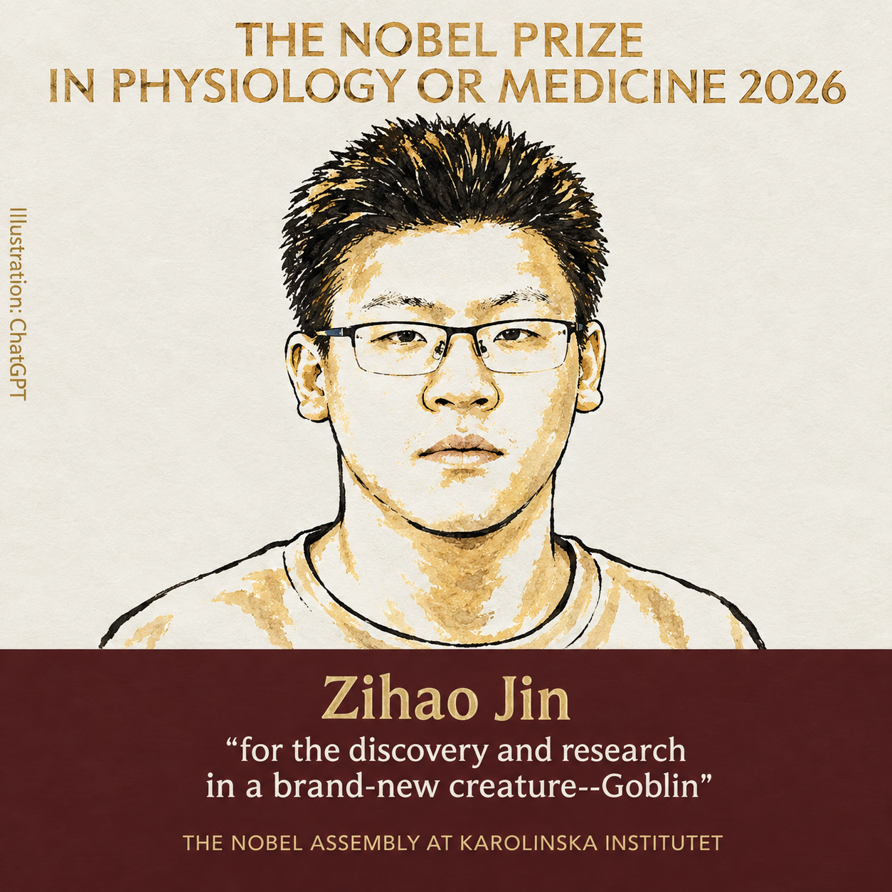

# Goblin-Research
Dr. Jin对于处于人类社会的一种神秘生物Goblin进行了细致的研究

---

 Goblin in people's imagination 

# Dr. Jin 研究了多年 Goblin，获得2026年 Nobel Prize in Physiology or Medicine 🏆

> 斯德哥尔摩快讯：

---

 Dr. Jin 

## 一、研究起点 

Dr. Jin 第一次遇见 Goblin，是他的高中时期，当时他仅仅只是坐在教室里，无意间发现了一种人形但显然不是人类的生物，没错，——Goblin，

通过几天隐蔽且严谨的观察之后，Dr. Jin 由此确认：

**这不是走丢的人类，这是一种把“别发现我”写进基因里的文明。**

此后四年，他追踪了许多座城市，总共观察了 3只 Goblin，并且初步与Goblin这类生物进行了交流。

## 二、研究过程

- **研究地点**：人类活动较少的场所，且大多是黑暗阴湿的环境。
- **主要诱饵**：人类吃剩的外卖。
- **样本规模**：3 只 Goblin，另有由于Dr. Jin在远处观察的原因，也曾误将真正的人类误认为成Goblin。
- **伦理审查**：狂躁、压抑的Goblin 拒绝签署知情同意书，但Dr. Jin通过某些方式获得了许可✅

---

## 三、样本 Goblin介绍

1. **Goblin Huang**:最早被发现的一只Goblin，在中国杭州活动，被认为有着最标准的Goblin基本特征，是Dr. Jin最初的研究样本。

   

   
 Photo of Goblin Huang by Dr. Jin 

   

2. **Goblin Fang**：体型较小的一只Goblin，在中国北京活动，与Goblin Huang有着较大的生活习性差异，进场与Goblin Lin同时出现，Dr. Jin认为其是Goblin Lin的跟班。

3. **Goblin Lin**：与Goblin Fang一起被Dr. Jin所发现，在中国北京活动，与Goblin Fang的习性相似，Dr. Jin经过简单评估认为其已经开始初步模仿人类的行为。

   
   
   
 Photo of Goblin Lin and Goblin Fang by Dr. Jin 

## 四、研究成果：Goblin行为分析🔬

### 1. Goblin的居住环境

Dr. Jin 经过漫长的跟踪，最终发现了Goblin的巢穴，并且他称其为：

**Gobliar**

通常来说Gobliar的环境是较为阴暗潮湿的，而且还往往伴有苔藓、地衣等植被的覆盖。令Dr. Jin感到意外的是，他在Gobliar中发现了一些人类的用品，比如说笔记本电脑、台灯、书籍等等，这或许说明Goblin这类生物拥有一定的智力，这也启发了Dr. Jin试图与Goblin进行初步的交流。

然而，当Dr. Jin想对Gobliar进行摄像时，被一只归巢的Goblin给发现了，显然Goblin对他人擅自闯入其巢穴的行为感到十分不满，Goblin愤怒地将Dr. Jin驱逐了出去，因此目前全世界仅存有一张珍贵的Gobliar图片。

有趣的是，真实的Gobliar与之前人类幻想中Goblin居住的环境有着高度的相似，或许这些所谓的幻想并非完全虚构，或许早在很久以前就已经有人类发现了Goblin这一物种的存在？

 Gobliar in Shanghai,China 

### 2. Goblin的食物喜好

Goblin喜欢人类的食物，但并非所有人类的食物，它们似乎对外卖比较感兴趣。

这个发现是Dr. Jin在中国杭州追踪一只Goblin时所注意到的，他所观察的Goblin多次游荡在人类使用的外卖柜附近，但是它躲藏得很好，几乎没有人注意到它，但是显然它谨慎得行为依旧被Dr. Jin所捕捉到。之后为了验证这个猜想，Dr. Jin自费购买了各种不同类别的外卖试图获得更加详细的结果，以下是实验结果：

| 外卖食物 | 食用频率 | 食用量 |
|---|---|---|
|          |          |        |
|          |          |        |
|          |          |        |

Dr. Jin指出，一个 Goblin在一周之内最少需要摄入5次外卖，否则Goblin会陷入一种精神上不健康的状态，它们会郁郁寡欢，进一步减少离开Gobliar的次数，试图通过睡眠等行为缓解负面情绪。

以及这里附上Dr. Jin苦心整理的[Goblin-Cookbook](./Goblin-Cookbook.md)

### 3. 破译了九声调语言 🗣️

Goblin 语言共有九个声调，其中第八声调的含义是：

> “我刚才在开玩笑。如果你生气，那我就没开玩笑。”

第九声调没有声音。它的含义是：

> “不要问。”

这一发现解释了多起国际误会。例如某银行自动取款机曾把 Goblin 第八声调识别为“请求转账”，导致三台机器连续吐出收据，并在屏幕上显示：“感谢您的耐心等待。”🏧

### 4. 提出“无意义缓冲理论” 🛋️

这是 Dr. Jin 最核心、也最像在胡说八道的成果。

他发现，Goblin 会在高压环境中主动制造无意义活动，例如：

- 给石头起名字；
- 评选“本周最像椅子的树桩”；
- 为一只袜子举行退休仪式；
- 认真讨论一块饼干应该先咬左边还是右边。

Dr. Jin 证明，这些行为并非浪费资源，而是文明的减震器。

> **一个社会如果完全没有无意义的东西，最后就会有意义地崩溃。**

公式化表达为：

**社会韧性 = 有效制度 × 幽默冗余 ÷ 严肃会议数量**

当分母趋近于无穷大时，文明开始要求所有人参加培训。📉

### 5. 记录了“点名消失反射” 👻

研究发现，98.7% 的 Goblin 在被完整叫出姓名后，会立即进入“刚才不在这里”状态。

这不是隐身魔法，而是一套高度成熟的社会防御机制。常见表现包括：

1. 缓慢蹲下；
2. 假装自己是一袋垃圾；
3. 指向远处并说“他往那边走了”；
4. 在人类转头时，以不符合人体工学的速度离开。

因此，论文建议基层管理者不要喊 Goblin 全名。可以使用更温和的称呼：

> “那位不愿意透露姓名的绿色同事。”

---

## 五、诺贝尔委员会评语 📜

> “表彰 Dr. Jin 在生物领域的卓越成就，Goblin这一物种的发现不仅仅是科学上的突破，更引发了人类对于自身的反思——是否在我们所认为的人类群体中，是否还有更多的、还未被发现的Goblin混在其中”

论文发表于：

**Jin, D. et al. (2026).**  
*Productive Pointlessness: Social Organization, Laughter Economics and the FIN Circuit in Urban Goblins.*  
Journal of Extremely Reluctant Anthropology, 42(7), 1–666.

---

