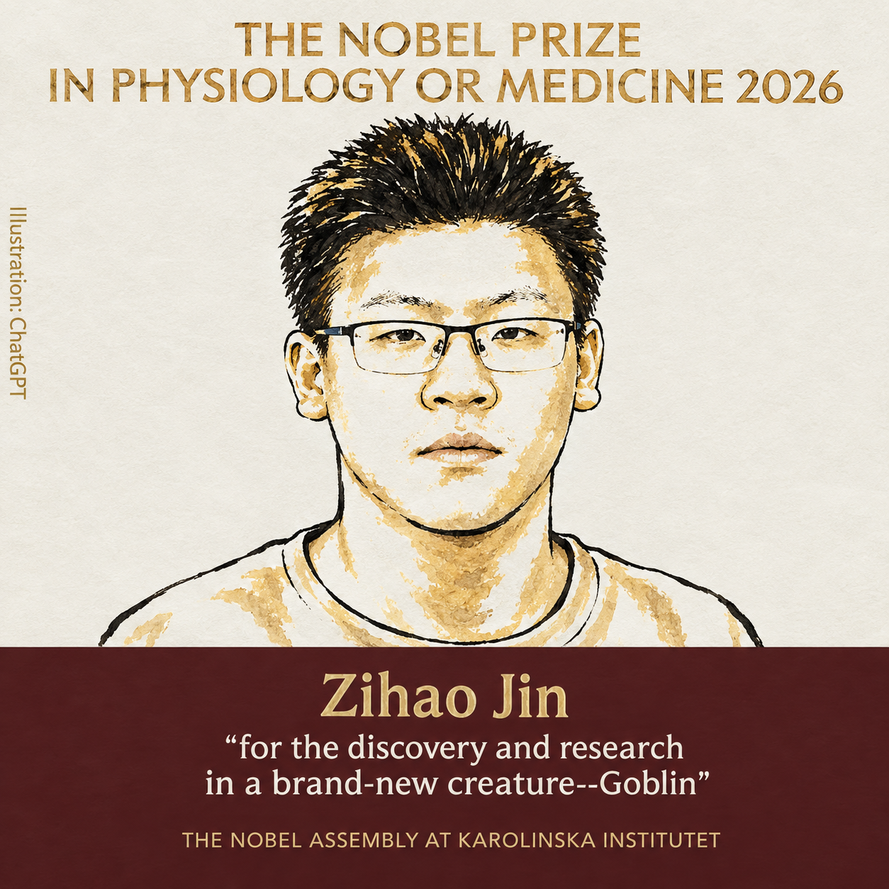
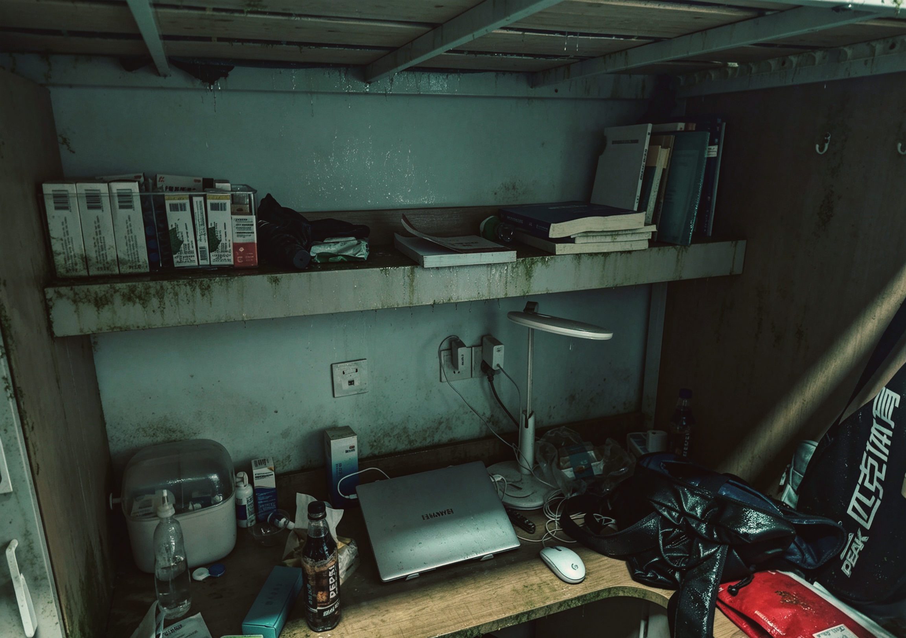
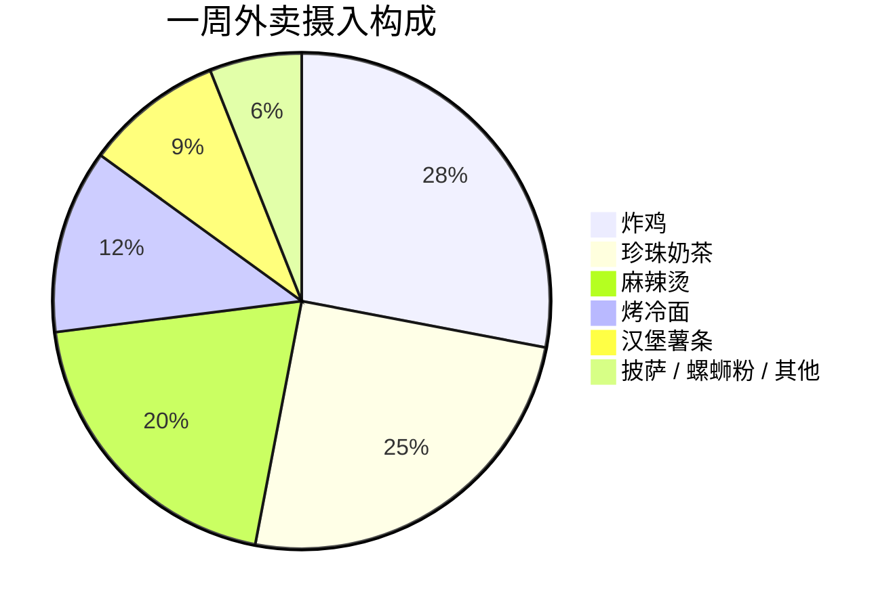
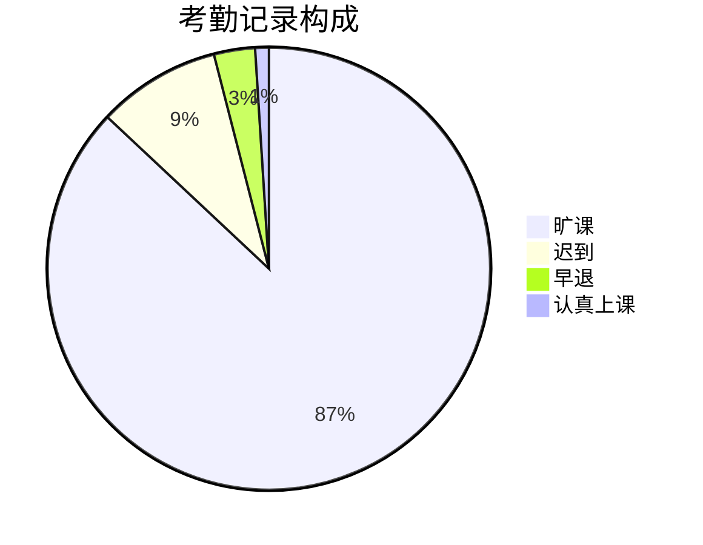
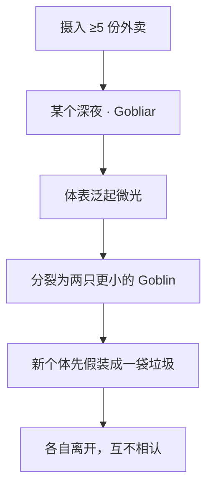

# Goblin-Research
Dr. Jin对于处于人类社会的一种神秘生物Goblin进行了细致的研究

---

 Goblin in people's imagination 

# Dr. Jin 研究了多年 Goblin，获得2026年 Nobel Prize in Physiology or Medicine 🏆

> 斯德哥尔摩快讯：

---

 Dr. Jin 

## 一、研究起点

Dr. Jin 第一次遇见 Goblin，是他的高中时期，当时他仅仅只是坐在教室里，无意间发现了一种人形但显然不是人类的生物，没错，——Goblin。

那是 2009 年秋天的一节自习课。一个"新同学"坐在最后一排，全程没有翻开课本，只是专注地盯着窗外的一只猫。Dr. Jin 本想凑过去问他借一下作业，却注意到两件可疑的事：

1. 他没有书包；
2. 他的皮肤在日光灯下泛着一种不太自然的、介于菠菜与旧硬币之间的绿色。

当班主任点名让他回答问题、全班齐刷刷回头时——座位上只剩下了一袋垃圾。

多年以后，Dr. Jin 把这一幕郑重地写进论文，命名为 **"点名消失反射"**。而那天，他只是默默坐回座位，在草稿纸上写下："这不是走丢的人类。"

通过几天隐蔽且严谨的观察之后，Dr. Jin 由此确认：

**这不是走丢的人类，这是一种把"别发现我"写进基因里的文明。**

此后四年，他揣着笔记本、手电和半份没吃完的炸鸡，追踪了许多座城市，总共观察了 3 只 Goblin，并且初步与 Goblin 这类生物进行了交流。

## 二、研究过程

- **研究地点**：人类活动较少的场所，且大多是黑暗阴湿的环境。
- **主要诱饵**：人类吃剩的外卖。
- **样本规模**：3 只 Goblin，另有由于 Dr. Jin 在远处观察的原因，也曾误将真正的人类误认为成 Goblin。
- **伦理审查**：狂躁、压抑的 Goblin 拒绝签署知情同意书，但 Dr. Jin 通过某些方式获得了许可 ✅——最终在一份以爪印代替签名、以半块炸鸡作为报酬的协议上达成一致。

### 探索时间线

```mermaid
flowchart LR
    A[2009 · 高中教室\n初遇 Goblin] --> B[2009–2013 · 四年追踪\n多座城市]
    B --> C[外卖诱饵实验\n记录食性]
    C --> D[发现 Gobliar\n巢穴]
    D --> E[破译九声调语言\n记录习性]
    E --> F[2026 · 诺贝尔奖 🏆]
```

### 一次著名的乌龙事件

在杭州的追踪中，Dr. Jin 曾远远锁定一名"疑似 Goblin"，尾随其穿过三条街、两个便利店和一个停车场，最终在一个奶茶店门口，对方回头问了一句："你也是来买奶茶的吗？"

那是一位穿着绿色卫衣的人类。

Dr. Jin 在笔记中写道：**"如果 Goblin 想伪装成人类，最好的策略就是穿绿卫衣、排奶茶店——因为没人会怀疑一个排队买奶茶的人。"** 此事后来被他收录进《常见误判案例》，以提醒后来的研究者不要以衣取怪。

---

## 三、样本 Goblin介绍

1. **Goblin Huang**:最早被发现的一只Goblin，在中国杭州活动，被认为有着最标准的Goblin基本特征，是Dr. Jin最初的研究样本。

   

   
 Photo of Goblin Huang by Dr. Jin 

   

2. **Goblin Fang**：体型较小的一只Goblin，在中国北京活动，与Goblin Huang有着较大的生活习性差异，经常与Goblin Lin同时出现，Dr. Jin认为其是Goblin Lin的跟班。

3. **Goblin Lin**：与Goblin Fang一起被Dr. Jin所发现，在中国北京活动，与Goblin Fang的习性相似，Dr. Jin经过简单评估认为其已经开始初步模仿人类的行为。

   
   
   
 Photo of Goblin Lin and Goblin Fang by Dr. Jin 

## 四、研究成果：Goblin行为分析🔬

### 1. Goblin的居住环境

Dr. Jin 经过漫长的跟踪，最终发现了Goblin的巢穴，并且他称其为：

**Gobliar**

通常来说Gobliar的环境是较为阴暗潮湿的，而且还往往伴有苔藓、地衣等植被的覆盖。令Dr. Jin感到意外的是，他在Gobliar中发现了一些人类的用品，比如说笔记本电脑、台灯、书籍等等，这或许说明Goblin这类生物拥有一定的智力，这也启发了Dr. Jin试图与Goblin进行初步的交流。

然而，当Dr. Jin想对Gobliar进行摄像时，被一只归巢的Goblin给发现了，显然Goblin对他人擅自闯入其巢穴的行为感到十分不满，Goblin愤怒地将Dr. Jin驱逐了出去，因此目前全世界仅存有一张珍贵的Gobliar图片。

有趣的是，真实的Gobliar与之前人类幻想中Goblin居住的环境有着高度的相似，或许这些所谓的幻想并非完全虚构，或许早在很久以前就已经有人类发现了Goblin这一物种的存在？

 Gobliar in Shanghai,China 

### 2. Goblin的食物喜好

Goblin喜欢人类的食物，但并非所有人类的食物，它们似乎对外卖比较感兴趣。

这个发现是Dr. Jin在中国杭州追踪一只Goblin时所注意到的，他所观察的Goblin多次游荡在人类使用的外卖柜附近，但是它躲藏得很好，几乎没有人注意到它，但是显然它谨慎得行为依旧被Dr. Jin所捕捉到。之后为了验证这个猜想，Dr. Jin自费购买了各种不同类别的外卖试图获得更加详细的结果，以下是实验结果：

| 外卖食物 | 食用频率 | 食用量 |
|---|---|---|
| 炸鸡全家桶 | 每天 2 次 | 一次 3 桶（连桶） |
| 珍珠奶茶 | 每天 4 次 | 一次 7 杯，珍珠必须双倍 |
| 麻辣烫（特辣） | 每天 1 次 | 一份"能淹死一只猫"的份量 |
| 烤冷面 | 每周 5 次 | 一次 12 张，要求"老板多放亿点" |
| 汉堡薯条套餐 | 每周 3 次 | 一次 8 个汉堡 + 9 份大薯 |
| 披萨 | 每周 2 次 | 一次 3 张 12 寸，边边也绝不剩下 |
| 螺蛳粉 | 每周 1 次 | 一次 5 碗，连汤喝完 |

Dr. Jin 据此指出：Goblin 的食量与自身体型严重不符，属于教科书级的**贪吃暴食**；更诡异的是，它们吃完会把包装袋、筷子、吸管整整齐齐叠好，再悄悄放回外卖柜附近——"不是爱干净，是希望下次还有得吃。"

```mermaid
pie title 一周外卖摄入构成
    "炸鸡" : 28
    "珍珠奶茶" : 25
    "麻辣烫" : 20
    "烤冷面" : 12
    "汉堡薯条" : 9
    "披萨 / 螺蛳粉 / 其他" : 6
```

Dr. Jin指出，一个 Goblin在一周之内最少需要摄入5次外卖，否则Goblin会陷入一种精神上不健康的状态，它们会郁郁寡欢，进一步减少离开Gobliar的次数，试图通过睡眠等行为缓解负面情绪。

以及这里附上Dr. Jin苦心整理的[Goblin-Cookbook](./Goblin-Cookbook.md)

### 3. Goblin的语言

经过长期窃听（以及若干次被发现的仓皇逃跑），Dr. Jin 破译了 Goblin 的语言，结论令人意外：

**Goblin 无法组织逻辑复杂的语言，只会用只言片语，并且大量使用拟声词。**

- **词汇量极小**：据估计常用词不超过 50 个，但拟声词多达上千种。
- **表达不了复杂逻辑**：它们永远说不出"如果明天不下雨，我可能会来"这种句子，只会说——"明天？咕噜。不来。咕噜。"
- **高度节能**：能蹲下绝不多说，能用拟声词绝不用动词。

Dr. Jin 记录的部分拟声词如下：

| 拟声词 | 大致含义 | 备注 |
|---|---|---|
| 咕噜 | 饿 / 有吃的 | 声调不同可表示"很饿"或"那是陷阱" |
| 噗叽 | 踩到水坑 / 表示不满 | 也用于形容人类写的代码 |
| 咔哒 | 同意 / 点头 | 连发三声表示"超级同意但懒得说" |
| 嘶—— | "有人来了，蹲下" | 所有 Goblin 听到都会立刻变成一袋垃圾 |
| 咚 | "我撞到门了" | 语气助词，无实义 |
| 呼噜呼噜 | "这个外卖不错" | 进食时高频出现 |
| 啪嗒啪嗒 | 小跑 / 逃走 | 多伴随"点名消失反射" |

此外，Goblin 语言共有九个声调，其中第八声调的含义是：

> "我刚才在开玩笑。如果你生气，那我就没开玩笑。"

第九声调没有声音。它的含义是：

> "不要问。"

这一发现解释了多起国际误会。例如某银行自动取款机曾把 Goblin 第八声调识别为"请求转账"，导致三台机器连续吐出收据，并在屏幕上显示："感谢您的耐心等待。"🏧

### 4. Goblin的上课出勤率

为了更靠近外卖柜，部分 Goblin 疑似混入人类学校就读。Dr. Jin 通过考勤系统、监控录像与垃圾桶取证，得出了惊人的结论：

**Goblin 经常旷课，且从不做作业。**

- 它们长期旷课、迟到、早退，出勤率令人发指；
- 作业本上通常只有几道爪印、一摊口水印，以及一个歪歪扭扭的"咕噜"；
- 好不容易来一次，也会从上课睡到放学，醒来第一句是"外卖？"。

最离谱的是"被点名即消失"：老师一喊全名，它当场触发**点名消失反射**，于是考勤系统默认记"旷课"——这大概是史上最冤枉的旷课，因为它明明在，只是"刚才不在这里"了。

```mermaid
pie title 考勤记录构成
    "旷课" : 87
    "迟到" : 9
    "早退" : 3
    "认真上课" : 1
```

> 注：那 1% 的"认真上课"，经查证是因为它走错了教室，又不好意思在众目睽睽之下消失。

Dr. Jin 还缴获过一张 Goblin 的请假条，全文如下：

> 尊敬的老师：
> 我今天不来。原因：咕噜。
> 此致。敬礼。
> （一个爪印）🐾

至于作业？它们把大量时间花在了"无意义缓冲"上——给石头起名字、评选"本周最像椅子的树桩"、为一只袜子举行退休仪式——而不是写作业。Dr. Jin 提醒：**不要试图催它们交作业，那只会得到一声"嘶——"。**

### 5. Goblin的生理特性

目前 Dr. Jin 记录到的三只样本，**全部为雄性**。

- 尚未发现任何雌性个体；
- 也未观察到任何交配行为（可能因为它们太害羞，也可能因为根本没这回事）。

据此，Dr. Jin 提出一个大胆的假说：

**Goblin 或许以自体分裂（无性繁殖）的方式繁衍后代。**

```mermaid
flowchart TD
    A[摄入 ≥5 份外卖] --> B[某个深夜 · Gobliar]
    B --> C[体表泛起微光]
    C --> D[分裂为两只更小的 Goblin]
    D --> E[新个体先假装成一袋垃圾]
    E --> F[各自离开，互不相认]
```

这一假说尚待验证。Dr. Jin 曾尝试给 Goblin Huang 连续加餐七天以诱发分裂，结果它只是变得更圆，并学会了"咕噜"的第七种声调。

其他已确认的生理特征如下：

| 特征 | 描述 |
|---|---|
| 体色 | 深浅不一的绿色，紧张时偏黄 |
| 视力 | 夜视极佳，但对"作业本"选择性失明 |
| 发声 | 以拟声词为主，见第 3 节 |
| 耐受力 | 对外卖耐受度极高，辣度上限未知 |
| 繁殖 | 疑为自体分裂，待验证 |

---

## 五、诺贝尔委员会评语 📜

> "表彰 Dr. Jin 在生物领域的卓越成就，Goblin这一物种的发现不仅仅是科学上的突破，更引发了人类对于自身的反思——是否在我们所认为的人类群体中，是否还有更多的、还未被发现的Goblin混在其中"

论文发表于：

**Jin, D. et al. (2026).**  
*Productive Pointlessness: Social Organization, Laughter Economics and the FIN Circuit in Urban Goblins.*  
Journal of Extremely Reluctant Anthropology, 42(7), 1–666.

---

## 六、帮助Dr. Jin发现更多Goblin

显然，在人类社会中存在着不少Goblin，它们或许已经融入了人类社会许多年，但是为了科学的进步以及人类文明的发展，全球范围内以Dr. Jin为代表的Goblinsage创立了基金会——The Goblindewell Foundation，为了更好的研究这个新发现的物种同时保护它们免受人为的伤害。

[Click here](./Goblindwell-Foundation-Charter.md) to know more about The Goblindewell Foundation!

此外，你也可以在这个仓库的issue界面里直接上传你所发现的Goblin，Dr. Jin会对你所提供的信息进行分析，感谢你为人类进步做出的贡献。

## 七、哥布林探测器 🧌

不确定身边的某人是不是哥布林？试试 Dr. Jin 监制的[哥布林探测器](https://saul-tarantino.github.io/Goblin-Research/goblin-app/)：
输入姓名、可选上传照片，即可生成检测报告，喊出全名还会触发“点名消失反射”。

[👉 打开哥布林探测器](https://saul-tarantino.github.io/Goblin-Research/goblin-app/)
